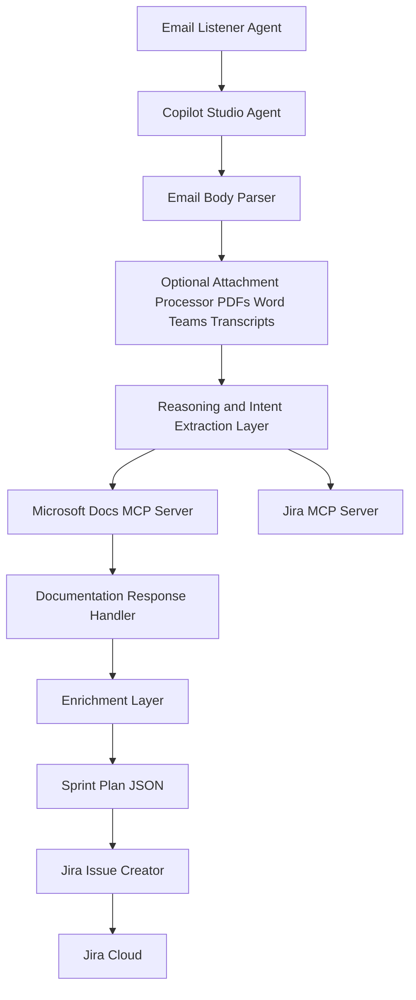

# SprintForge

## Summary
SprintForge is an AI-powered scrum assistant that converts call transcripts and rough planning notes into structured sprint plans enriched with authoritative Microsoft documentation. Using MCP servers, it retrieves relevant Microsoft guidance and automatically creates tasks in Jira. SprintForge accelerates planning, reduces manual effort, and improves engineering execution quality.

## Current Challenges
Modern agile teams face recurring challenges:
- Sprint planning is manual, time-consuming, and error-prone.
- Scrum Masters struggle to turn long unstructured conversations into actionable work items.
- Engineering teams depend on accurate references to Microsoft documentation but rarely find or apply them consistently.
- Creating Jira items during or after planning meetings leads to delay, duplication, and missing context.
- AI copilots exist, but they lack real integration with enterprise systems like Jira and Microsoft Docs through a unified interface.
- Existing copilots do not combine reasoning + documentation + Jira automation into one experience.

SprintForge resolves these challenges by acting as an intelligent orchestrator that listens, interprets, references, and executes.

## User Case Narrative
A Scrum Master receives an email containing rough planning notes or a transcript from a Teams call. Instead of manually turning them into Jira tasks, they forward that email to SprintForge.

SprintForge then:
1. Listens for the incoming email.
2. Reads the email body and extracts sprint goals, epics, stories, tasks, owners, and blockers.
3. Optionally processes attachments such as:  
   - Teams call transcripts  
   - PDF design notes  
   - Meeting minutes  
   - Word docs with planning details  
4. Identifies Azure and Microsoft services in the text.
5. Calls an MCP documentation server to fetch Microsoft Learn references.
6. Enriches each story with acceptance criteria, implementation notes, and links.
7. Uses the Jira MCP server to create issues directly in Jira.

## So here is our hack..
SprintForge is built using:
- Microsoft Copilot Studio  
- Microsoft Model Context Protocol MCP  
- Documentation MCP server for Microsoft Learn  
- Jira MCP server for work-item creation  
- Single conversational agent combining extraction, enrichment, and automation  

Below is the solution architecture.

## Solution Benefits and Value

### Business Value
- Up to appx. 70 percent reduction in sprint preparation time.
- Eliminates manual conversion of email notes into Jira.
- Ensures consistent and reliable use of Microsoft documentation.
- Reduces planning fatigue and misinterpretation.
- Immediate transition from planning discussion to execution-ready Jira items.
- Supports enterprise governance and repeatability.

### Technical Value
- Demonstrates real-world Copilot Studio extensibility via MCP.
- Shows multi-source ingestion: email body, attachments, transcripts.
- Integrates with Microsoft Learn for authoritative guidance.
- Automates Jira creation into a fully low-code workflow.
- Offers reusable patterns for future enterprise copilots.

## Prerequisites
- Microsoft Power Platform environment  
- Access to Microsoft Copilot Studio  
- Email-triggered Copilot Studio bot enabled  
- MCP server for Microsoft Docs  
- MCP server for Jira  
- Jira Cloud instance with API credentials  
- SprintForge solution ZIP file imported into your environment  

## Version History
| Version | Date | Authors | Notes |
|---------|---------|-------------|--------|
| 1.0 | 2025 | Shrushti Shah and Bhushan Gawale | Initial hackathon release of SprintForge |

## This demo illustrates
- AI extraction of sprint-ready tasks 
- Ingestion of email content as the primary planning input  
- Optional processing (to be implemented) of attachments such as call transcripts or team call recording notes  
- Retrieval of Microsoft documentation via MCP  
- Jira item creation through MCP automation  
- Real-time reasoning and enrichment  

## Find solution zip and import the solution in Power Platform environment
The solution package is available in the repository’s deployment folder.  
Import it using:  
Power Apps Admin Center → Solutions → Import → Upload ZIP